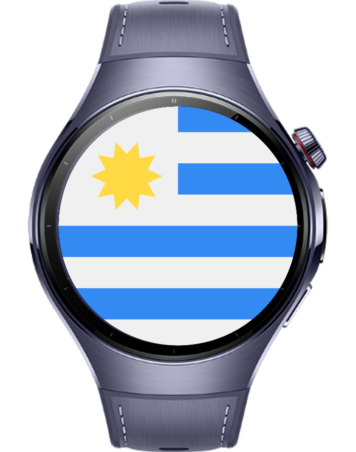
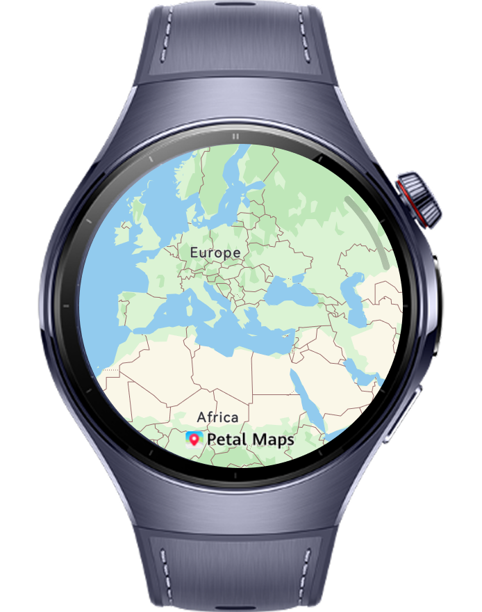
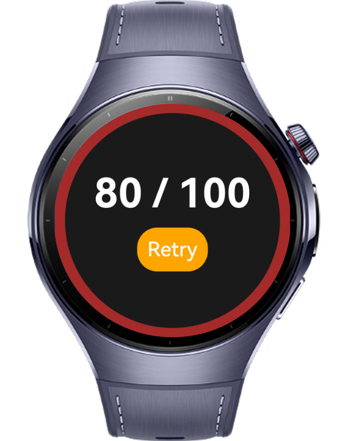

> **Note:** To access all shared projects, get information about environment setup, and view other guides, please visit 

# Guess Where

Guess Where is a wearable quiz game that users need to make a guess on the map to find the correct country where the flag has been shown of it. 

# Preview

<div>
  
  
  

</div>

# Use Cases

1. Users can start the application by clicking on the start button then application shows country flags randomly for 5 seconds.
2. Users need to choose the related country on the map after each flag questions.
3. At the end of the game, users can check the total point.

# Technology

## Stack

- **Languages**: ArkTS, ArkUI
- **Frameworks**: HarmonyOS 5.1.0(18)
- **Tools**: DevEco Studio Vers 5.1.0.828SP1,
- **Libraries**: @kit.ArkUI, @kit.MapKit, @kit.LocationKit

## Required Permissions

- `ohos.permission.LOCATION`
  > Required to get location information.
- `ohos.permission.APPROXIMATELY_LOCATION`
  > Required to get approximate location.
- `ohos.permission.LOCATION_IN_BACKGROUND`
  > Required to use location services in background

# Directory Structure

```
entry/src/main/ets/
├───entryability
│       EntryAbility.ets
│
├───entrybackupability
│       EntryBackupAbility.ets
│
├───pages
│       Index.ets
│       SplashScreen.ets
│
├───services
│       LocationServices.ets
│
├───types
│       Location.ets
│       Place.ets
│
├───utils
└───viewmodel
        PlaceList.ets

```

# Constraints and Restrictions

## Suported Devices

- Huawei Watch 5

## Limitations

- Guess Where is not working on previewer or simulators
- Users need to apply location permissions and enable location in smart watch

# License

**Guess Where** is distributed under the terms of the MIT License
See the [LICENSE](/LICENSE) for more information.
